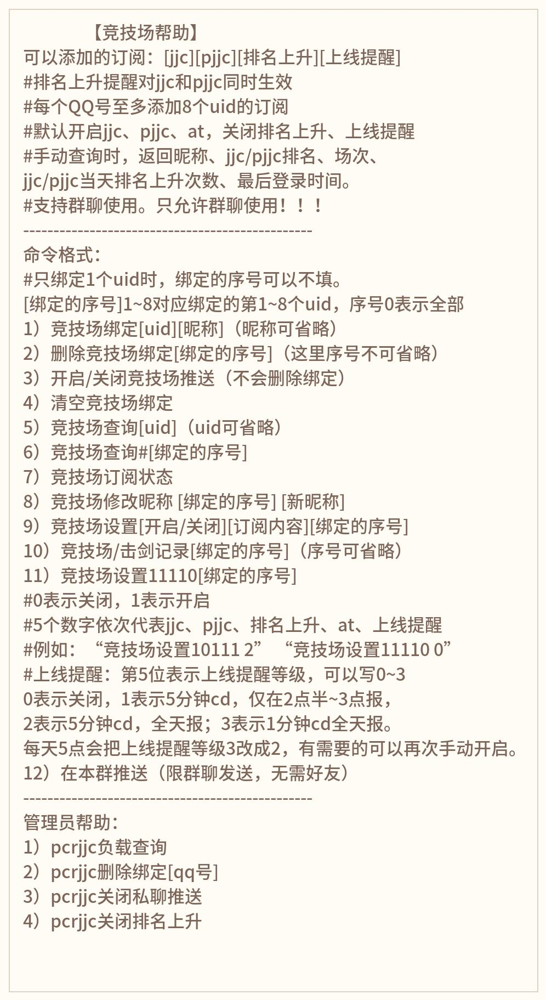

# nonebot-plugin-pcrjjc

### 介绍

* 基于[pcrjjc_huannai](https://github.com/SonderXiaoming/pcrjjc_huannai)的代码基础上进行重构
* 可独立作为nonebot2插件使用，不依赖于HoshinoBot


### 安装和更新

##### 使用nb-cli安装与更新
在 nonebot2 项目的根目录下打开命令行，执行
```shell
nb plugin install nonebot-plugin-pcrjjc --upgrade
```
##### 使用pip安装和更新
在 nonebot2 项目的根目录下打开命令行，进入nonebot2项目虚拟环境，执行
```shell
pip install --upgrade nonebot-plugin-pcrjjc
```
并在项目根目录下的`pyproject.toml`文件, 在`[tool.nonebot]`部分追加写入
```toml
plugins = ["nonebot_plugin_pcrjjc"]
```


### 具体指令如下




### 配置项

**在nonebot2项目中的`.env`开头的文件添加下表配置项，其中非必填项可不填**

|      配置项       |    类型     | 是否必填  |   默认值   |           说明           |
|:--------------:|:---------:|:-----:|:-------:|:----------------------:|
|   SUPERUSERS   | list[str] | True  |         | 超级用户QQ号，示例：["114514"]  |
|  PCRJJC_GROUP  |    str    | False |  None   | 当私聊不可用时，使用指定群聊推送要私聊的消息 |
|      OTTO      |   bool    | False |  True   |    是否自动过验证码（不建议修改）     |
|    VERSION     |    str    | False | "6.2.0" |         客户端版本号         |
|    MAX_PRI     |    int    | False |    0    |         最大私聊人数         |
|   MAX_PCRID    |    int    | False |    8    |       每人绑定的最大数量        |
|  MAX_HISTORY   |    int    | False |   50    |        单人最多历史记录        |
| NOTICE_CD_MIN  |    int    | False |   10    |     上线提醒时间间隔（单位：分）     |
| REFRESH_SECOND |    int    | False |    3    |      排名刷新频率（单位：秒）      |
|  PCRJJC_ACCOUNTS  |   list    | True  |    ""     |       登录账号（模板如下）       |

登录账号（即PCR_ACCOUNTS）模板
```python
PCRJJC_ACCOUNTS='[
    {
     "account": "account1",
     "password": "password",
     "platform": 2,
     "channel": 1
    },
    {
     "account": "account2",
     "password": "password",
     "platform": 2,
     "channel": 1
    }
]'
```

